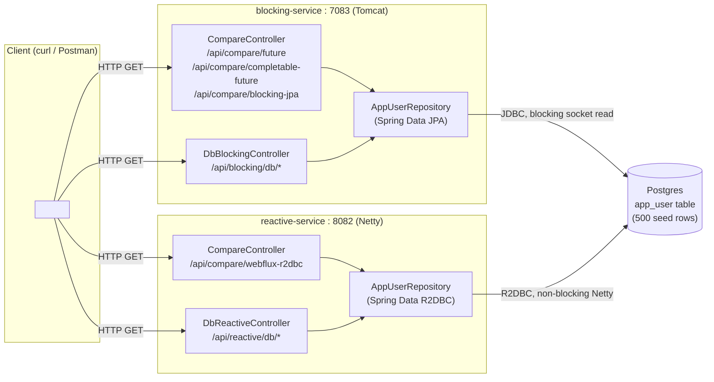
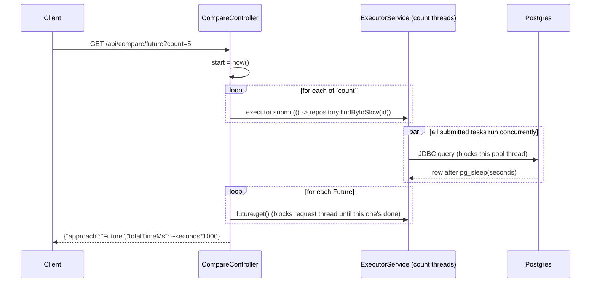
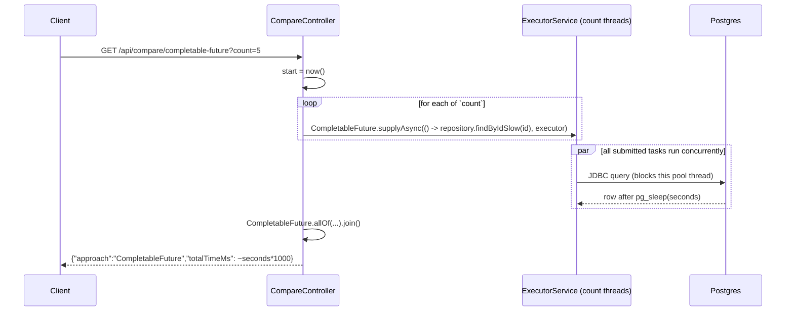
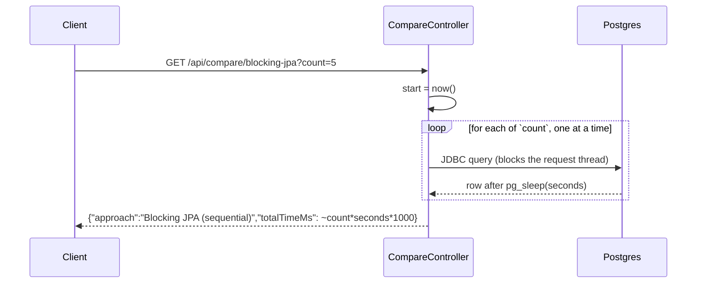

# Blocking I/O vs Non-blocking I/O — Spring Boot Demo

Two services, same real Postgres database, two different I/O models. Four endpoints answer one question each: **how long does it take to fetch `count` users?**

| Module              | Model                          | Server | DB driver |
|---------------------|---------------------------------|--------|-----------|
| `blocking-service`  | Blocking I/O (Spring MVC)       | Tomcat (thread-per-request) | JPA/JDBC (Hikari pool) |
| `reactive-service`  | Non-blocking I/O (Spring WebFlux) | Netty (event loop) | R2DBC (r2dbc-pool) |

## Architecture



Both repositories run the same query shape — `SELECT *, pg_sleep(:seconds) FROM app_user WHERE id = :id` — so every DB call takes about `seconds` regardless of which service handles it. That's what makes the timing comparison fair: the only variable is how each approach *waits* for that call.

## 1. Start Postgres

```bash
cd blocking-vs-nonblocking-demo
docker compose up -d
```

Seeds the `app_user` table with 500 rows (`init-db/init.sql`).

## 2. Build & run

```bash
mvn clean install
mvn -pl blocking-service spring-boot:run   # terminal 1
mvn -pl reactive-service spring-boot:run   # terminal 2
```

Default ports: blocking-service `7083`, reactive-service `8082` (check `application.yml` in each module if you've changed them).

## The main thing: `/api/compare/*`

### 1. `Future` — `GET /api/compare/future?count=5&seconds=1`



### 2. `CompletableFuture` — `GET /api/compare/completable-future?count=5&seconds=1`



### 3. Blocking JPA (sequential) — `GET /api/compare/blocking-jpa?count=5&seconds=1`



### 4. WebFlux + R2DBC — `GET /api/compare/webflux-r2dbc?count=5&seconds=1`

```mermaid
sequenceDiagram
    participant Client
    participant Controller as CompareController
    participant Loop as Netty event loop (no extra threads)
    participant DB as Postgres

    Client->>Controller: GET /api/compare/webflux-r2dbc?count=5
    Controller->>Controller: start = now()
    Controller->>Loop: Flux.range(1,count).flatMap(id -> repository.findByIdSlow(id))
    par all `count` calls subscribed at once, non-blocking
        Loop->>DB: R2DBC query (registers callback, thread is free)
        DB-->>Loop: row after pg_sleep(seconds)
    end
    Loop-->>Controller: .then(...) fires once all results arrive
    Controller-->>Client: {"approach":"WebFlux + R2DBC","totalTimeMs": ~seconds*1000}
```

### Run them yourself

```bash
curl "http://localhost:7083/api/compare/future?count=5&seconds=1"
curl "http://localhost:7083/api/compare/completable-future?count=5&seconds=1"
curl "http://localhost:7083/api/compare/blocking-jpa?count=5&seconds=1"
curl "http://localhost:8082/api/compare/webflux-r2dbc?count=5&seconds=1"
```

Each returns just the number you're after:

```json
{"approach": "Future", "count": 5, "totalTimeMs": 1106}
```

Actual output from this repo (`count=5`, `seconds=1`):

| Approach | totalTimeMs |
|---|---|
| Blocking JPA (sequential) | 5053 |
| Future | 1106 |
| CompletableFuture | 1010 |
| WebFlux + R2DBC | 1075 |

**Reading it:** sequential blocking JPA takes `count × seconds` (5 × 1s ≈ 5s) because each call waits for the previous one to finish. `Future` and `CompletableFuture` get back down to ~1s by handing the blocking calls to a thread pool so they run concurrently — that's blocking I/O made faster with *more threads*. `WebFlux + R2DBC` gets the same ~1s result **without a thread pool at all** — the non-blocking driver just registers a callback per call and lets them all run concurrently on its own small event-loop, no extra threads created per request.

Try it with `count=20` or `count=50` to make the gap more dramatic.

### Verified in Postman

Actual requests/responses captured from Postman (`count=5`, `seconds=1`):

| Request | Status | Postman time | Size | Response body |
|---|---|---|---|---|
| `GET /api/compare/future?count=5&seconds=1` | 200 OK | 1063 ms | 214 B | `{"approach":"Future","count":5,"totalTimeMs":1023}` |
| `GET /api/compare/completable-future?count=5&seconds=1` | 200 OK | 1056 ms | 225 B | `{"approach":"CompletableFuture","count":5,"totalTimeMs":1028}` |
| `GET /api/compare/blocking-jpa?count=5&seconds=1` | 200 OK | 5.09 s | 233 B | `{"approach":"Blocking JPA (sequential)","count":5,"totalTimeMs":5070}` |
| `GET /api/compare/webflux-r2dbc?count=5&seconds=1` | 200 OK | 1271 ms | 130 B | `{"approach":"WebFlux + R2DBC","count":5,"totalTimeMs":1214}` |

Postman's own "time" column runs a little higher than each response's `totalTimeMs` (e.g. 1063ms vs 1023ms for `/future`) — that gap is connection setup + network + JSON serialization around the request, which `totalTimeMs` doesn't include since it's measured with `System.currentTimeMillis()` purely around the DB calls inside the JVM. The `blocking-jpa` gap (5.09s vs 5070ms) is the clearest example: same ~20ms of HTTP overhead, but it barely registers next to 5 seconds of sequential `pg_sleep`.

## Other API calls

The underlying CRUD endpoints each service's `/api/compare/*` sits on top of. Full request collection: [postman/blocking-vs-nonblocking-demo.postman_collection.json](postman/blocking-vs-nonblocking-demo.postman_collection.json) — import it into Postman directly.

### blocking-service (`http://localhost:7083`)

| Method | Endpoint | Description |
|---|---|---|
| GET | `/api/blocking/db/users/{id}` | Plain JPA `findById` |
| GET | `/api/blocking/db/users/{id}/slow?seconds=1` | Same lookup, with `pg_sleep(seconds)` on the DB side |
| GET | `/api/blocking/db/users?count=5` | Sequentially fetches `count` users |
| POST | `/api/blocking/db/users` | Create a user — body `{"name": "...", "email": "..."}` |
| GET | `/api/blocking/db/pool-stats` | Hikari pool occupancy + live JVM thread count |

### reactive-service (`http://localhost:8082`)

| Method | Endpoint | Description |
|---|---|---|
| GET | `/api/reactive/db/users/{id}` | Plain R2DBC `findById` |
| GET | `/api/reactive/db/users/{id}/slow?seconds=1` | Same lookup, with `pg_sleep(seconds)` on the DB side |
| GET | `/api/reactive/db/users?count=5` | Concurrently fetches `count` users via `flatMap` |
| POST | `/api/reactive/db/users` | Create a user — body `{"name": "...", "email": "..."}` |
| GET | `/api/reactive/db/pool-stats` | r2dbc-pool occupancy + live JVM thread count |

## Cleanup

```bash
docker compose down        # stop Postgres (add -v to also drop the seeded data volume)
```
